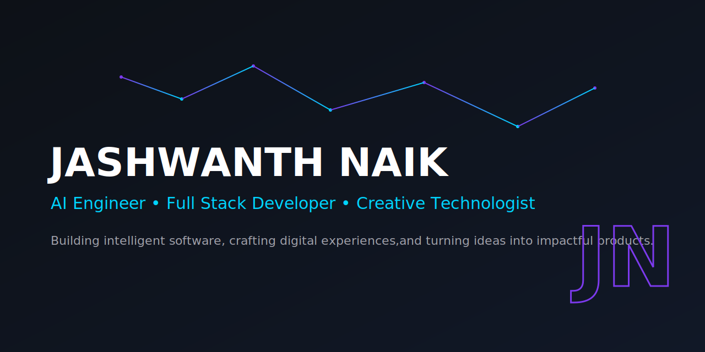

<!-- ========================================= -->
<!--           JASHWANTH GITHUB PROFILE        -->
<!-- ========================================= -->

<div align="center">



# Hi, I'm Jashwanth Naik 👋

### AI Engineer • Full Stack Developer • Creative Technologist

<p align="center">
Building intelligent software, crafting digital experiences, and turning ideas into impactful products.
</p>

<p align="center">

</p>

<p align="center">

<a href="YOUR_LINKEDIN">

</a>

<a href="YOUR_PORTFOLIO">

</a>

<a href="mailto:YOUR_EMAIL">

</a>

</p>

</div>

---

# 🚀 About Me

I'm an AI & Data Science undergraduate passionate about building intelligent software, scalable web applications, and AI-powered products.

I enjoy combining machine learning, backend engineering, and modern frontend technologies to solve real-world problems.

Beyond software development, I have experience in leadership, branding, and creative storytelling, allowing me to bridge the gap between technology and user experience.

---

## 💡 Current Focus

- 🤖 Building AI-powered applications
- 🌐 Developing modern Full Stack projects
- 🧠 Exploring Agentic AI & LLMs
- ☁️ Learning scalable backend architecture
- 🚀 Preparing for Software Engineering roles
- 💙 Contributing to impactful open-source projects

---

# 🛠️ Tech Arsenal

<div align="center">

### Languages


<br/><br/>

### Artificial Intelligence & Data Science


<br/>


<br/><br/>

### Full Stack Development


<br/><br/>

### Tools & Platforms


</div>

---

# 💼 Experience & Leadership

## 🚀 Founder — THE BOOT CONNECT

Creative technology initiative focused on:

- 🎬 Video production & editing
- 🎨 Branding & digital design
- 📱 Social media content strategy
- ✨ Creative solutions for businesses

---

## 🎤 PR Secretary — IIIT Raichur

Leading communication and media initiatives by:

- Managing institute-level campaigns
- Coordinating student teams
- Creating digital content
- Supporting major college events

---

## 📷 Photography Club Coordinator

Combining technology and storytelling through:

- Event photography
- Visual storytelling
- Media production
- Creative direction

---

## 🎥 Freelance Creative Developer

Worked with clients on:

- Video editing
- Content creation
- Digital branding
- Social media creatives

---

# 🌱 Currently Learning

```text
Artificial Intelligence
        ↓
Agentic AI Systems
        ↓
Large Language Models
        ↓
Full Stack Product Development
        ↓
Scalable Software Engineering
```

---
# 🚀 Featured Projects

<div align="center">

Projects where I combine AI, engineering, and creativity to build practical solutions.

</div>

---

## 🌍 Traveler Hub

### Full Stack Travel Planning Platform

A modern travel platform designed to simplify trip planning and create personalized travel experiences.

### ✨ Highlights

- 🗺️ Interactive travel experience
- 🔐 Secure user authentication
- 🌐 Modern responsive interface
- ⚡ Full-stack architecture

### 🧰 Tech Stack

`Next.js` `React` `Tailwind CSS` `MongoDB` `Mongoose` `Clerk`

🔗 Repository: [View Project](https://github.com/Jashwanth14/travel-hub)

---

## 🧠 Explainable AI Based Emotion Recognition System

### Understanding Human Emotions Through Computer Vision

An AI-powered system that recognizes facial emotions while providing explainable insights into model predictions.

### ✨ Highlights

- 👁️ Computer Vision based emotion analysis
- 🤖 Deep Learning approach
- 🔍 Explainable AI integration
- 📊 Model interpretation

### 🧰 Tech Stack

`Python` `TensorFlow` `OpenCV` `Deep Learning` `XAI`

🔗 Repository: [View Project](https://github.com/Jashwanth14/mini-1)


---

## 🤖 Agentic AI Experiments

### Exploring Autonomous AI Systems

Researching and building applications using modern AI concepts including:

- LLM workflows
- AI agents
- Tool-based reasoning
- Automation systems

### 🧰 Tech Stack

`Python` `LLMs` `LangChain` `AI Agents`

---

## 🌐 Personal Portfolio Website

### My Digital Identity

A personal portfolio showcasing my projects, experience, and technical journey.

### ✨ Highlights

- Modern UI design
- Responsive experience
- Project showcase
- Developer branding

### 🧰 Tech Stack

`Next.js` `React` `Tailwind CSS` `Vercel`

🔗 Website: [Visit Portfolio](jashnaik.vercel.app)


---

